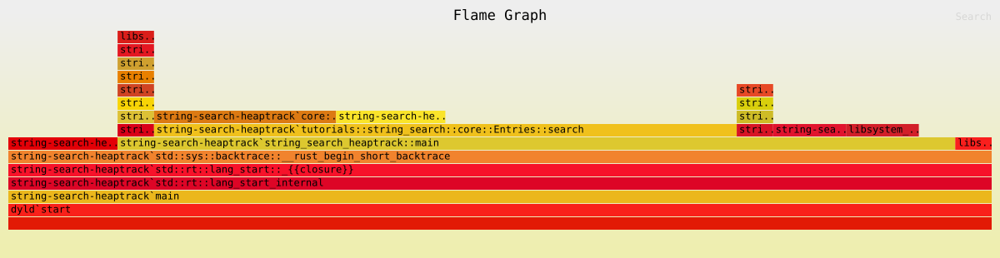

# string-search

## flamegraph

Run as follows, also works on Mac.

```
cargo flamegraph --root --flamechart --verbose --bin string-search-heaptrack
```



## heaptrack

Run `./run_heaptrack.sh`.  Tested on Debian 12.

Connect to a remote host using `ssh -X` to allow forwarding `heaptrack_gui`.
